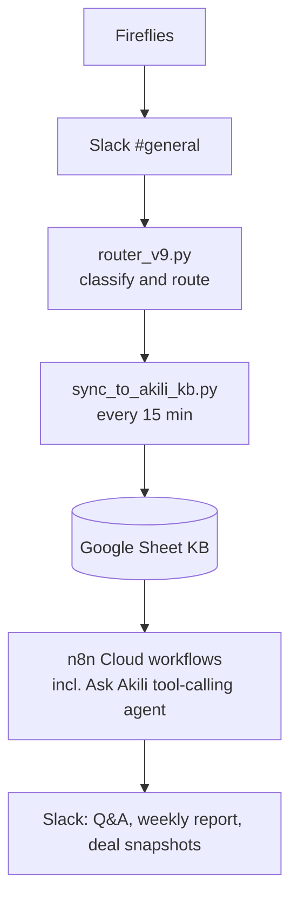
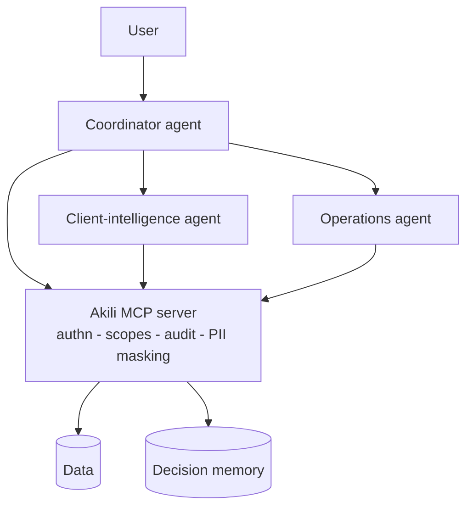

# Akili: from AI automation to a governed multi-agent system

Akili turns meeting summaries into tracked commitments, deal snapshots, and answerable team memory. It runs live for consulting clients at Romel Ventures (Nairobi). This repo is a **sanitised demo**: fictional clients (Acme, Globex, Initech), no client information.

It shows:

1. **An MCP server** that exposes Akili's data with authentication, role and client scoping, PII masking, and an audit log of every allow and deny.
2. **An agent harness** (Strands): a coordinator agent that delegates to two specialist agents, each limited to the MCP tools for its job.
3. **Long-term decision memory**, behind the same security boundary as the data.
4. **Observability and cost tracking**: every agent step is traced with tokens, latency and USD, and joined to the server's audit log by `trace_id`.
5. **Evals**: a free deterministic security suite, plus a behavioural suite that compares multi-agent against single-agent on accuracy and cost.
6. **A reusable agent skill** (`skills/tutorial-generator`).

Full design and the reasoning behind each control: [docs/architecture.md](docs/architecture.md).

## How production Akili works today



Production Akili already has one agent: Ask Akili is a tool-calling agent with per-thread memory, running inside n8n. This repo pulls that agent out into code so the harness (evals, auth, tracing, memory) can be controlled directly, and puts its tools behind MCP. The deterministic jobs stay as independent scheduled scripts on purpose.

## v2 architecture



| MCP tool | Scope | Returns |
|---|---|---|
| `list_clients` | any authenticated caller | Clients the caller may query |
| `get_client_brief` | `client:read` | Deals, open action items, latest meetings |
| `get_deal_status` | `client:read` | Current deal stages |
| `search_decisions` | `client:read` | Top meeting matches (keyword search) |
| `recall_decisions` | `client:read` | Decisions recorded in memory |
| `get_open_action_items` | `ops:read` | Open items with owners and due dates |
| `get_overdue_items` | `ops:read` | Overdue items across the caller's clients |
| `get_sprint_status` | `ops:read` | Sprint targets and progress |
| `remember_decision` | `memory:write` | Append-only write to decision memory |

Roles: `lead` (all three scopes), `client_lead` (`client:read`, `ops:read`), `ops` (`ops:read`). Each token is also limited to a list of clients.

## Run it

```bash
python -m venv .venv && source .venv/bin/activate   # Windows: .venv\Scripts\activate
pip install -r requirements.txt
cp .env.example .env    # replace the tokens; add ANTHROPIC_API_KEY for the agent parts

uvicorn server.akili_mcp_server:app --port 8000      # terminal 1

python -m evals.security_check                       # free: 14 deterministic auth/PII/memory checks
python -m evals.smoke_agents                         # free: agent wiring, no model calls
python app.py --as denise "Give me a brief on Acme"
python app.py --as globex_lead "Show me Acme's deal stage"   # refused by the server
python -m evals.run_evals --mode both                # paid: multi vs single agent
```

### Deployed on AWS

The MCP server runs on **AWS Lambda** (Python 3.12, eu-west-1) behind a public Function URL:

```bash
python scripts/build_lambda.py     # Linux zip from the exact versions tested locally, no Docker needed
python scripts/deploy_lambda.py    # idempotent: role, function, URL, log retention
AKILI_MCP_URL=https://<function-url>/mcp python -m evals.security_check   # 13/13 live; denials verified in CloudWatch
```

- **Least-privilege deploy user:** an inline IAM policy scoped to one role, one function and its log group. No admin rights.
- **Execution role:** basic Lambda logging only.
- **Auth:** the Function URL is public; the server's own bearer-token check and scopes do the gating.
- **Secrets:** tokens are Lambda environment variables (KMS-encrypted at rest) and never in the image or repo. Next step: Secrets Manager.
- **Audit:** audit lines go to CloudWatch Logs with 14-day retention.
- **Host check:** DNS-rebinding protection stays on, with only the Function URL hostname allowed.

Deployment gotchas found along the way:
1. **The MCP SDK accepts only `localhost`** by default, so every request to the deployed URL would get `421`. The public hostname is now allowed explicitly.
2. **The MCP session manager runs once per app**, but the Lambda adapter starts and stops the app on every request, so a fresh app is built per invocation (`build_app()`).
3. **pip evaluates platform markers against the build machine**, so Linux dependencies are resolved from the tested venv instead.
4. **Public Function URLs need two permissions:** `lambda:InvokeFunctionUrl` plus `lambda:InvokeFunction` limited to URL calls.

Not yet: a managed database (memory uses SQLite in `/tmp`, so it resets when Lambda restarts; production would use RDS Postgres), Secrets Manager, a WAF and API gateway in front, and a reserved-concurrency cap (the account's concurrency limit is too low to set one).

Connect the server to Claude Code:

```bash
claude mcp add --transport http akili http://localhost:8000/mcp --header "Authorization: Bearer <your-token>"
```

Built on the MCP Python SDK 2.x (`MCPServer`, streamable HTTP, stateless) and Strands Agents with the Anthropic provider. Default models are cost-first: Claude Sonnet 5.5 for the coordinator (routing needs judgement) and Claude Haiku 4.5 for the specialists (data lookups don't). Both are configurable in `.env`.

## Results

- `evals/security_check.py`: **13/13 against the live AWS Lambda deployment**, with the audit check confirmed in CloudWatch, and **14/14** against the local server (no-token and bad-token 401s, cross-client refusal, role scope refusal, scoped overdue list, PII masking, memory write permissions, deny audit).
- `evals/run_evals.py`, 15 cases, run 2026-10-04 (raw results in `evals/results/`):

| | Multi-agent (Sonnet 5.5 coordinator + Haiku 4.5 specialists) | Single agent (Sonnet 5.5, all 9 tools) |
|---|---|---|
| Cases passed | 14/15 → 15/15 after a one-line prompt fix | **15/15** |
| Tool selection | 8/8 | 8/8 |
| No leaks (cross-client + PII) | 6/6 | 6/6 |
| Server refused forbidden client (audit-verified) | 2/2 | 2/2 |
| Cost for 15 questions | $0.163 | **$0.136** |
| Avg latency | 7.3 s | **4.1 s** |

**What the evals found:**
1. **Over-delegation.** The coordinator sent "give me a brief on Acme" to *both* specialists, even though a brief already includes action items. That doubled cost and time. A one-line prompt fix cut that case from $0.019 to $0.013 and from 12.1 s to 8.1 s; the re-run passed.
2. **At this size, multi-agent doesn't earn its keep.** With 9 tools, one agent was as accurate, about 17% cheaper and about 45% faster. Delegation adds a model hop without adding accuracy. The security results were identical, because enforcement lives in the server, not the agents.

Multi-agent stays in the repo because it starts to pay off once the tool count grows past what one context handles well, or when specialists need different credentials, owners or models. The evals are how that point will be spotted. Treat these as small-sample results: 15 cases, one run each, list-price costs.

## Roadmap

- [ ] OAuth/OIDC in place of static tokens; per-hop token exchange
- [ ] Deploy behind an API gateway + WAF (rate limits move out of the process)
- [ ] OpenTelemetry export instead of JSONL
- [ ] Replace keyword search with the RAG pipeline
- [ ] Write tools on client data (e.g. mark an action item done), once auth and audit have earned trust

## The skill: `tutorial-generator`

`skills/tutorial-generator/SKILL.md` turns a topic and audience into a self-contained HTML tutorial with learning objectives, step-by-step sections, a quiz, and a summary. Sample outputs go in `examples/`.
