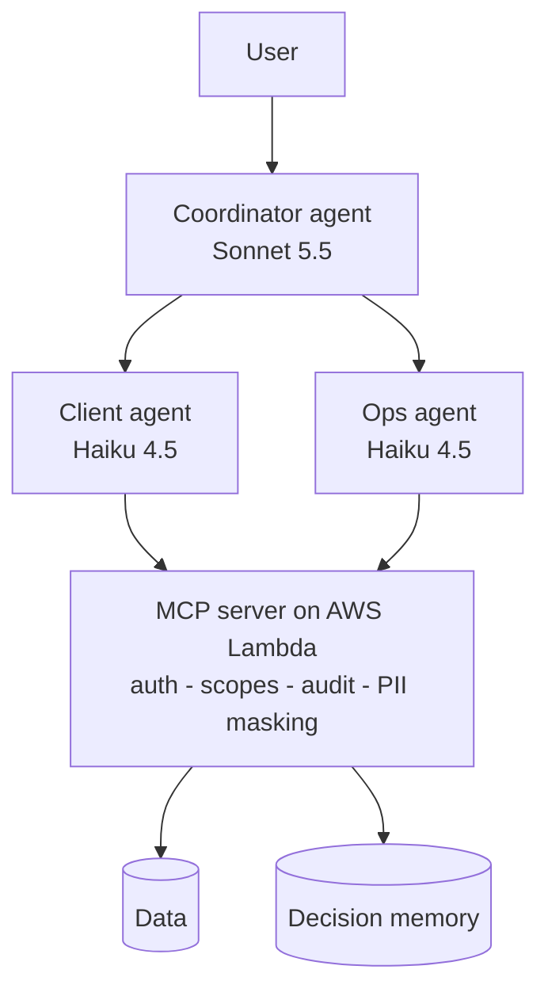

# Akili demo: a governed multi-agent AI system

An MCP server with authentication, access control, audit logging and PII masking, deployed on AWS Lambda, with Claude agents on top and evals that measure whether multi-agent is worth it.

|  |  |
|---|---|
| **Built with** | Python · MCP (Python SDK 2.x) · Strands Agents · Claude (Sonnet 5.5, Haiku 4.5) · AWS Lambda · CloudWatch · GitHub Actions |
| **Status** | MCP server live on AWS Lambda; CI runs the security suite on every push |
| **Security** | 13/13 checks pass against the live deployment; denials verified in CloudWatch |
| **Key finding** | At 9 tools, one agent matched multi-agent (15/15) and was 17% cheaper and 45% faster |

## Why this exists

Production Akili is a set of Python scripts and n8n workflows that the Romel Ventures team (Nairobi) uses in Slack. Its question-answering agent lived inside n8n, where it couldn't be tested, permission-scoped or cost-tracked.

This repo pulls that agent into code and puts its data behind an MCP server that enforces who sees what. It adds audit, PII masking, tracing and cost tracking, then uses evals to test whether multi-agent helps.

It's a production-oriented demo on fictional clients (Acme, Globex, Initech), not production itself. Production Akili is separate and unchanged.

## Architecture



- **Every tool call** passes through the server in order: authenticate, check role, check client, audit (allow or deny), run, mask PII. The model is never the security boundary.
- **Three roles:** `lead`, `client_lead` and `ops`. Each token is also limited to a list of clients.
- **Tracing:** every agent step is logged with tokens, latency and cost, and joined to the audit log by `trace_id`.

Design rationale: [docs/architecture.md](docs/architecture.md).

## Results

| 15 eval cases | Multi-agent | Single agent |
|---|---|---|
| Passed | 15/15 (after a one-line fix) | 15/15 |
| Cost | $0.163 | $0.136 |
| Avg latency | 7.3 s | 4.1 s |

Both setups had 0 leaks across 6 leak tests and refused 2/2 forbidden requests (verified in the audit log). Security results are identical because enforcement lives in the server, not the agents.

- **The evals caught over-delegation.** The coordinator sent a simple brief to both specialists. A one-line prompt fix cut that case from $0.019 to $0.013.
- **Multi-agent isn't justified yet.** It stays in the repo for when tools, owners or credentials diverge. This is a small sample: 15 cases, one run each.

## Run it

```bash
pip install -r requirements.txt
cp .env.example .env                                  # set tokens; add ANTHROPIC_API_KEY for the agents
uvicorn server.akili_mcp_server:app --port 8000

python -m evals.security_check                        # free: 14 auth/PII/memory checks
python app.py --as denise "Give me a brief on Acme"
python app.py --as globex_lead "Show me Acme's deal stage"   # refused by the server
python -m evals.run_evals --mode both                 # paid: multi vs single agent
```

Deploying to AWS (least-privilege IAM, CloudWatch audit, the gotchas found along the way): [docs/deployment.md](docs/deployment.md).

## Roadmap

OAuth/OIDC in place of static tokens · API gateway + WAF · managed Postgres for memory · OpenTelemetry · RAG search · write tools once audit has earned trust.

The repo also includes a reusable agent skill, [`skills/tutorial-generator`](skills/tutorial-generator/SKILL.md), with sample outputs in `examples/`.
