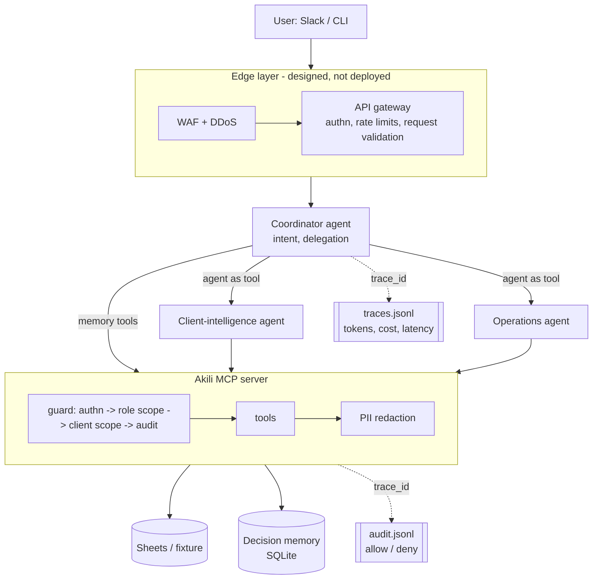

# Akili v2 architecture

## Request path

## Where each control lives, and why there

| Control | Where | Why there |
|---|---|---|
| Authentication | Edge (prod) + MCP server | The edge rejects junk cheaply; the server re-checks because it must never trust its caller. |
| Authorization (role scopes + client scoping) | MCP server `guard()` | Only the server knows which client a tool call targets. The model is never the security boundary: a prompt injection can make an agent *ask* for another client's data, and the server still refuses. |
| PII masking | MCP server, on every tool result | Minimise what reaches the model instead of trusting the model not to repeat it. |
| Rate limiting | Edge (prod); `EdgeGate` in the prototype | Protects cost and upstream APIs before any model or Sheets call happens. |
| WAF / DDoS | Edge only (e.g. CloudFront + AWS WAF + Shield, or Cloudflare) | Volumetric and signature attacks are an infrastructure problem; nothing inside an agent can absorb them. |
| Audit | MCP server, allow and deny | Every data access has a who/what/which-client record, joinable to the agent trace by `trace_id`. |
| Observability + cost | Agent harness (`observability/trace.py`) | Tokens and latency are only known where the model is called. |
| Memory | MCP tool backed by SQLite | Inherits the same auth, scoping, audit and PII masking as the client data. |
| Evals | `evals/` | `security_check.py` is deterministic and free (can gate a deploy); `run_evals.py` tests agent behaviour and compares multi- vs single-agent on cost and accuracy. |

## Deliberate non-choices

- **Not every function became an agent.** Deterministic jobs (router, sprint pulse, deadline nudger) stay scheduled scripts: agents add nondeterminism, latency and cost where reasoning isn't needed, and separate scripts keep a failure in one from taking down another.
- **One MCP server, filtered per agent**, rather than one server per agent. Capability boundaries come from each specialist's tool list plus server-side scopes; splitting into several servers is a deployment decision for when teams or credentials diverge.
- **Static bearer tokens in the prototype.** Production moves `identify()` to OAuth/OIDC with scoped tokens; `authorize()` doesn't change.
- **Keyword search, not vectors.** RAG belongs behind `search_decisions` later; the agents don't need to change when it does.

## Production gaps (honest list)

- The user's token is forwarded as-is; production should exchange it for a short-lived, audience-scoped token per hop.
- Trace state is a module global (single-user CLI). Use contextvars / OpenTelemetry spans for concurrent requests.
- Cost figures use list prices and ignore prompt-caching discounts, so they are an upper bound.
- Rate limiting is in-process and per-instance; it moves to the gateway.
